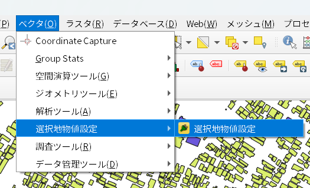
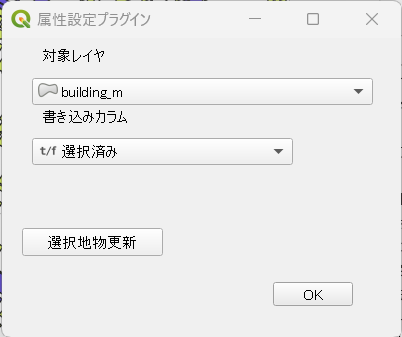

# 選択地物属性書き込みプラグイン

QGIS地図画面上で指定レイヤの地物を選択

ダイアログ上でレイヤとフィールドを指定

ダイアログ上の更新ボタンクリックで選択した地物の指定カラムに値を書き込む

現状ではフィールドの型が　論理型の場合は　True   整数型の場合は　1  浮動小数点型の場合は 1.0  文字列型の場合は　　"1"   を書き込んでいる

インストールして有効にすると「ベクタ」メニューの「選択地物値設定」で起動可能

対象レイヤ　書き込みカラムを指定する

指定レイヤをアクティブにして地図上で地物を選択する

「選択地物更新」ボタンをクリックすると属性が更新される

指定属性の値で描画スタイルが指定されていると地図の描画もデータ更新時に行われる

属性値がいきなり書き換わるので注意が必要